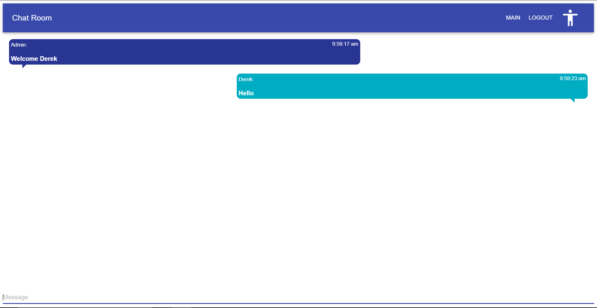

# ChatRoom
React based web application that allows the users to type messages to each other in socket based chat rooms.

## Installation

### API
```
Install the API:      npm install
```

### Client
```
Install the client:   npm install
```

## Usage

### API
```
Start the API:        node src/app.js
```

### Client
```
Start the client:     react-scripts start
```


